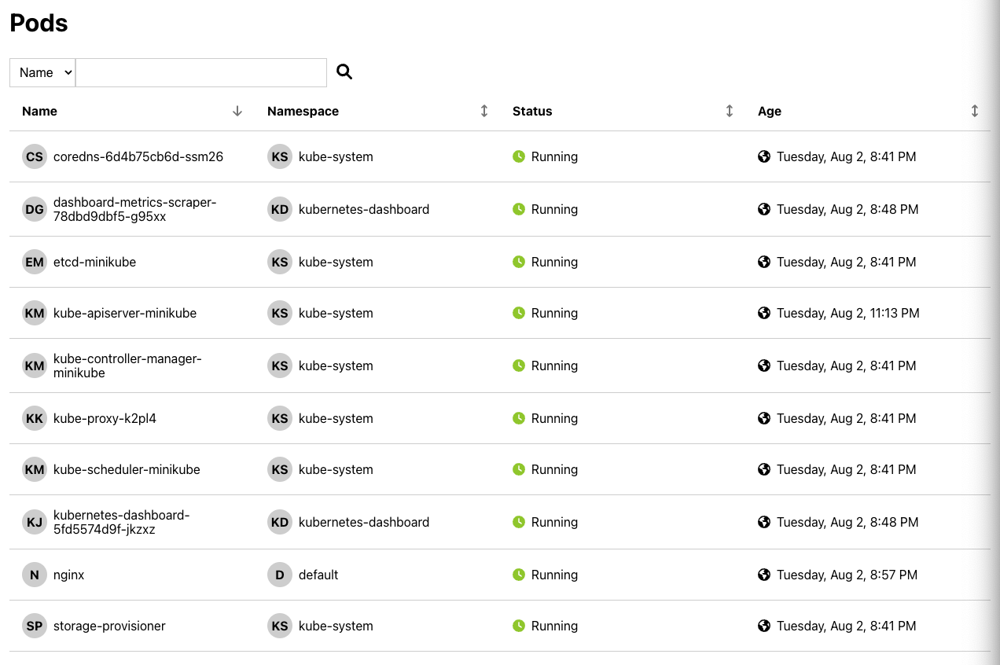
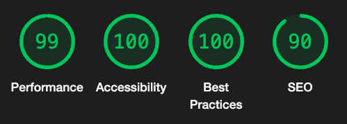

# List all Kubernetes Pods
As a K8s administrator I should be able to view pods’ details in my cluster.



# Configure the App
- Open [.env.development](./.env.development) file
- Replace `REACT_APP_API_URL` with the minikube proxy url

# Enable CORS in minikube proxy
- CORS must be enabled in order to allow the web app to fetch data from the proxy server.
- Make sure to include `cors-allowed-origins` `config`.

```
minikube start --extra-config "apiserver.cors-allowed-origins=["http://\*"]"
```

# Running the Application

In the project directory, you can run:

### `npm start`

Runs the app in the development mode.\
Open [http://localhost:3000](http://localhost:3000) to view it in your browser.

The page will reload when you make changes.\
You may also see any lint errors in the console.

### `npm test`

Launches the test runner in the interactive watch mode.\
See the section about [running tests](https://facebook.github.io/create-react-app/docs/running-tests) for more information.

### `npm run build`

Builds the app for production to the `build` folder.\
It correctly bundles React in production mode and optimizes the build for the best performance.

The build is minified and the filenames include the hashes.\
Your app is ready to be deployed!

See the section about [deployment](https://facebook.github.io/create-react-app/docs/deployment) for more information.

# Lighthouse Score
This score is generated for desktop.



# Enhancement Areas
## State Management
Application state can be moved to `redux store`. Currently application state is managed by each component. This is not included because `redux` was not in approved libraries list.

## Unit Testing
Unit test cases are included only for few components. The coverage can be enhanced.

## End to end testing
Cypress tests can be written to test the application's end-to-end flow. This is not included because `cypress` was not in approved libraries list.
